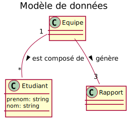

# Laboratoire #1

## Introduction (4 points)
- En utilisant "Markdown preview enhanced" du menu contextuel de visual studio code vous pouvez obtenir une prévisualisation du rapport. 
- En utilisant la commante "ctrl + shift + p" vous pouvez voir toutes les opérations que vous pouvez effectuer sur ce fichier

## Analyse (8 points)
Réaliser votre modèle de données à l'aide de plant uml et insérer l'image génére ici.

## Conception (13 points)

|Titre|Description|
|-----|-----------|
|table|Ceci est une table|

## Implémentation et algorithmes (8 points)
> Vous pouvez insérer du html et css directement dans votre fichier markdown.

## Discussion (8 points)

# Conclusion (4 points)
Générer un rapport avec le format **markdown** et __plantuml__ permet de rester dans l'environnemnt de développement sans avoir à utiliser d'outils externe.
- Menu contextuel "Markdown PDF: export (pdf)"
  

<a href="../../../README.md">Retour au fichier: README.md</a>

